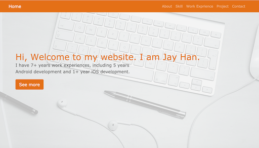

**[Resume Website](https://hanqingzhen-jayhan.github.io/)**

# Web Resume

This project is based on Bootstrap 4 and Github Page. The code is clean and easy to understand.

Only need a couple of hours, you can build your own web resume from scratch.

**Website**

**Mobile **

## Content :

1. Navigation Bar
2. Header
3. About
4. Skills
5. Work experience
6. Project
7. Contact

## Highlights

#### 1. [Css selector](https://www.w3.org/TR/CSS22/selector.htmlt)

#### 2. [Box model](https://www.w3.org/TR/CSS22/box.html)

#### 3. [Inheritance, cascading](https://www.w3.org/TR/CSS22/cascade.html)

#### 4. [Order matter](https://vecta.io/blog/definitive-guide-to-css-styling-order)

#### 5. [Bootstrap Grid layout](https://getbootstrap.com/docs/4.0/layout/grid/)

#### 6. [clas vs id](https://css-tricks.com/the-difference-between-id-and-class/)

## Reference

[Learn Bootstrap 4](https://medium.com/free-code-camp/learn-bootstrap-4-in-30-minute-by-building-a-landing-page-website-guide-for-beginners-f64e03833f33)

[Github Page](https://pages.github.com/)

[Github Page Guide](https://guides.github.com/features/pages/)

[Bootstrap 4](https://getbootstrap.com/docs/4.0/getting-started/introduction/)

[Scroll Nav](https://blackrockdigital.github.io/startbootstrap-scrolling-nav/)

[icons](https://icons8.com/icons/)

[iconify](https://iconify.design/icon-sets/)

[Head First HTML and CSS.pdf](https://github.com/SabraAS/ProgrammingBooks/blob/master/Head%20First%20HTML%20and%20CSS%20-%202nd%20Ed.pdf)

